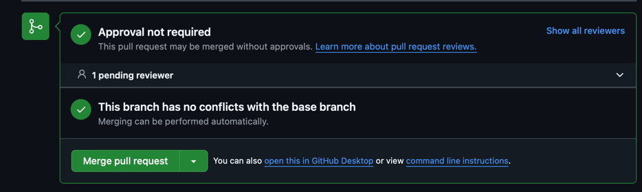

# 💌 SOULSYNC  
### CSC207FW24 Course Final Project

## 📜 Contributing Conventions

When making contributions, please follow the commit message conventions below to keep the project organized and maintainable:

> **Commit Message Format**: `type: message`

### Commit Types
- `fix:` - Use for bug fixes.
- `feat:` - Use for new features.
- `chore:` - Use for maintenance tasks (e.g., updating dependencies, configuration changes).


## ✅ TODOs

#### 1. Verify `MainWithDB` Functionality
- Ensure that `MainWithDB` still runs as expected (from Lab 5).
- Re-clone and re-run if needed.

#### 2. Create a New Branch with Your UTORid
- Create and switch to a branch with your UTORid as the branch name.

```bash
  git branch chuyian
  git switch chuyian
  git branch
   ```

4. Try adding your name under Contributors in ReadME and make a Pull Request. Happy!

```bash
  git add .
  git commit -m "chore add ----"
  git push --set-upstream origin branchname
   ```
Follow pull request instructions in terminal, make sure "branch has no conflicts with the base branch".
      

## Tasks


## 🌟 Contributors
1. **Yi-An Chu** (Kimi)
2. **Sataphon Obra** (PF)
3. **Lapatrada Jaroonjetjumnong (Claire)**
4. **Kay Zin Thant** (Yolanda)
5. **Thitiwut Pattanasuttinont** (Mac)


## Notes
1. After implementing view must add to MainWithDB set up with UseCaseFactory which follows flow:      
   - loginInteractor (execute which calles loginPresenter.prepareSuccessView
   - login interactor executi is inplementation of logininputBoundary.java
   - loginController calls loginUseCaseInteractor.exe
   - LoginView.java
   ```bash
          loginController.execute(
                    currentState.getUsername()
                    currentState.getPassword()
                   );
   ```